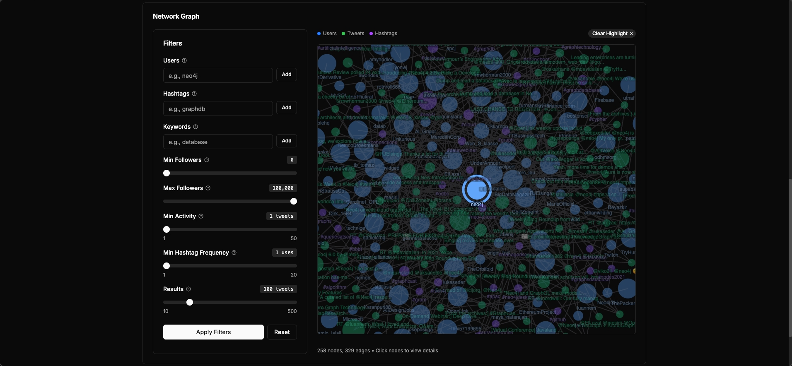
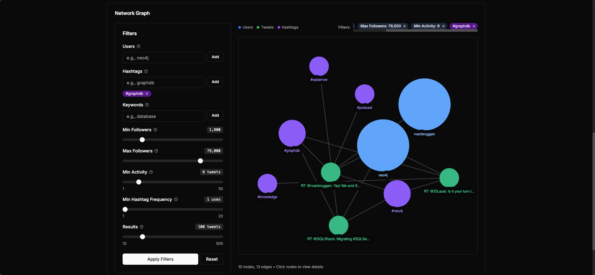

# Twitter Network Analysis Dashboard

An interactive web application for visualizing and analyzing Twitter network data using Neo4j graph database, powered by AI semantic search and natural language queries.

   

## Features

- **Interactive Network Graph** - Force-directed visualization with zoom, pan, and click interactions
- **AI Semantic Search** - Find tweets by meaning using ML embeddings (not just keywords)
- **Natural Language Queries** - Ask questions in plain English, powered by Google Gemini AI
- **Entity Details** - Deep dive into users, hashtags, and tweets
- **Modern UI** - Dark/light mode, responsive design, smooth animations

## Quick Start

### Option 1: Docker Deployment (Recommended)

**Prerequisites:** Docker & Docker Compose only

```bash
# 1. Clone repository
git clone https://github.com/gopaljigaur/twitter-neo4j
cd twitter-neo4j

# 2. Create .env file
cp .env.example .env
# Edit .env and set your credentials (see .env.example for all required variables)

# 3. Start everything
docker-compose up --build -d

# (loads data + generates embeddings)
```

Open [http://localhost:3000](http://localhost:3000)

To stop: `docker-compose down`

---

### Option 2: Local Development

**Prerequisites:** Node.js 20+ (v22 recommended) and Docker (for neo4j)

```bash
# 1. Clone and install
git clone https://github.com/gopaljigaur/twitter-neo4j
cd twitter-neo4j
npm install

# 2. Start Neo4j
docker-compose up -d neo4j

# 3. Configure environment
cp .env.example .env.local
# Edit .env.local with your credentials (see .env.example for all required variables)

# 4. Generate embeddings for semantic search (one-time, ~5-10 min)
npm run generate-embeddings

# 5. Start the app
npm run dev
```

Open [http://localhost:3000](http://localhost:3000)

## Usage Guide

This guide walks you through the main features of the Twitter Network Analysis Dashboard.

### Dashboard Overview

The dashboard has three main sections stacked vertically:

1. **Statistics Panel**: Shows overview metrics
   - Total counts: Users, Tweets, Hashtags
   - Top 5 Users (ranked by followers) - clickable to view details
   - Top 5 Hashtags (ranked by usage) - clickable to view details

2. **Search Panel**: Multi-tab search interface with two modes
   - **Regular Mode**: Three search types
     - Users: Search by username with autocomplete suggestions
     - Hashtags: Search by hashtag name with autocomplete suggestions
     - Tweets: AI semantic search (finds by meaning, not keywords)
   - **AI Query Mode**: Ask questions in plain English (requires Gemini API key)

3. **Network Graph**: Interactive visualization
   - Left: Filter controls (follower range, activity, hashtag frequency, node limit)
   - Right: Force-directed graph showing relationships


### 1. Network Graph Visualization

The network graph displays the relationships between users, tweets, and hashtags in an interactive force-directed layout.

**Features:**
- **Zoom**: Use mouse wheel or pinch gesture to zoom in/out
- **Pan**: Click and drag the background to move around
- **Node Interaction**: Click any node to open a detailed modal view
- **Color Coding**:
  - 🔵 Blue nodes: Users
  - 🟢 Green nodes: Tweets
  - 🟣 Purple nodes: Hashtags

**Graph Controls:**
- Use the filter panel on the left side to adjust:
  - Follower range (slider)
  - Minimum activity level (slider)
  - Hashtag frequency (slider)
  - Node limit (slider, for performance)
  - Specific users (multi-select dropdown)
  - Specific hashtags (multi-select dropdown)



### 2. Search Features

The search panel has two modes accessible via a toggle: **Regular Search** and **AI Query**. Regular search provides three search types via tabs.

#### 2.1 Regular Search Mode

**Users Tab:**
- Search by username or name
- **Autocomplete**: As you type (2+ characters), suggestions appear below
- Click a suggestion or press Enter to search
- Results show: Profile info, follower/following counts, tweet count
- Click any result to view detailed user information


**Hashtags Tab:**
- Search by hashtag name (without # symbol)
- **Autocomplete**: Suggestions appear as you type
- Results show: Hashtag name and usage count
- Click any result to view detailed hashtag information


**Tweets Tab - AI Semantic Search:**
- Finds tweets by **meaning**, not just exact keywords
- No autocomplete (uses AI to understand your query)
- Shows info box: "Powered by AI Semantic Search"

**How it works:**
1. Type a natural language query (e.g., "machine learning")
2. The system converts your query into a 384-dimensional vector
3. Finds tweets with similar meaning using cosine similarity
4. Returns results ranked by semantic similarity

**Example queries:**
- "graph databases" → Finds tweets about Neo4j, relationships, networks
- "machine learning" → Finds AI, neural networks, deep learning tweets
- "data visualization" → Finds tweets about charts, graphs, dashboards

**Why use it?**
- Understands context and meaning
- Finds related concepts automatically
- No need for exact keyword matches
- Uses local AI (no API key required)


#### 2.2 AI Query Mode

Ask complex questions in plain English. The AI translates your question into a Cypher query and executes it on the database.

**How to access:**
1. Toggle from "Regular" to "AI Query" mode using the button at the top
2. If Gemini API key is not configured, the button will be disabled with a tooltip

**How to use:**
1. See example queries listed as clickable pills at the top
2. Type your question in the text area or click an example to auto-fill
3. Click "Ask AI" or press Enter (Shift+Enter for new line)
4. View results in a table format with column headers
5. Toggle "Show Generated Query" to see the Cypher query that was executed

**Example questions:**
- "Find the top 10 users with the most followers"
- "Show me tweets about AI or machine learning"
- "Which users tweet most about Neo4j?"
- "Find the most popular hashtags"
- "Show users who are mentioned together frequently"

**Features:**
- Natural language to Cypher query translation (powered by Gemini AI)
- Automatically adds safety limits (default: 100 results, max: 1000)
- Specify different limits in your query (e.g., "top 5", "show 500")
- Shows column-based results (like a database query)
- Results are paginated (10 per page)
- Hashtags, mentions, and URLs in results are clickable

**Notes:**
- Requires Gemini API key. If not configured, you'll see "AI Query is currently unavailable" message.
- Default limit of 100 results is applied if not specified in your question


### 3. Entity Details (Modal Views)

Clicking on any entity opens a detailed modal view. These modals appear as overlays on top of the dashboard.

**User Details Modal:**
- Profile information (avatar, name, username)
- Statistics: Followers, Following, Tweet count
- Recent tweets by the user (with clickable hashtags/mentions)
- Action buttons:
  - "View in Graph": Updates graph filters to show this user's network
  - "Highlight in Graph": Zooms and highlights the user node in the graph
  - Close button (X)


**Tweet Details Modal:**
- Full tweet text (with clickable hashtags, mentions, URLs)
- Author information (clickable)
- Timestamp and favorite count
- Action buttons:
  - "View in Graph": Focuses on the tweet node in the graph
  - "Highlight in Graph": Zooms and highlights the tweet node
  - Close button (X)


**Hashtag Details Modal:**
- Hashtag name and usage count
- List of tweets using this hashtag (paginated, clickable)
- Action buttons:
  - "View in Graph": Updates graph to show this hashtag's network
  - "Highlight in Graph": Zooms and highlights the hashtag node
  - Close button (X)


### 4. Graph Filtering

Use the filter controls on the left side of the Network Graph to customize what's displayed:

**Available Filters:**
- **Follower Range**: Show only users within a specific follower count range
- **Minimum Activity**: Filter by tweet count
- **Hashtag Frequency**: Show only frequently used hashtags
- **Node Limit**: Control the number of nodes displayed (improves performance)
- **Specific Entities**: Select particular users or hashtags to focus on

**Tips:**
- Start with fewer nodes for better performance
- Gradually increase limits as needed
- Use filters to focus on specific communities or topics
- Combine multiple filters for precise exploration



## Tech Stack

**Frontend:**
- **Next.js 16** - Modern React framework with server-side rendering, API routes, and excellent developer experience
- **React 19** - Component-based UI with hooks for state management
- **TypeScript** - Type safety and better code maintainability
- **Tailwind CSS** - Utility-first CSS for rapid UI development
- **shadcn/ui** - Accessible, customizable component library built on Radix UI

**Backend:**
- **Next.js API Routes** - Serverless API endpoints co-located with frontend code
- **Neo4j Driver** - Official driver for efficient graph database queries

**Database:**
- **Neo4j 4.4** - Native graph database ideal for analyzing relationships and network data. Chosen for:
  - Efficient traversal of user-tweet-hashtag relationships
  - Native support for graph algorithms
  - Cypher query language for intuitive graph queries
  - Vector search capabilities for semantic search

**AI/ML:**
- **Xenova Transformers** - Browser-based ML models (all-MiniLM-L6-v2) for local semantic search without requiring external APIs
- **Google Gemini AI** - Advanced language model for natural language to Cypher query translation

## How It Works

### Semantic Search

1. Converts all tweets to 384-dimensional vectors using transformer models
2. At search time, converts your query to a vector
3. Finds tweets with highest cosine similarity
4. Example: Searching "machine learning" also finds "neural networks" and "AI"

### AI Natural Language Queries

1. You ask a question in plain English
2. System sends question + database schema to Gemini AI
3. AI generates a Cypher query
4. Query executes on Neo4j and returns results
5. Example: "Show me top 10 users with most followers"

### Graph Visualization

- Uses D3.js force simulation for natural node positioning
- Color-coded by entity type (Users, Tweets, Hashtags)
- Real-time filtering and highlighting
- Click any node to see detailed information

## Project Structure

```
twitter-neo4j/
├── app/
│   ├── api/              # API routes
│   │   ├── graph/        # Network data
│   │   ├── search/semantic/  # Semantic search
│   │   └── nl-query/     # AI queries
│   ├── components/       # React components
│   └── page.tsx          # Main page
├── lib/
│   └── neo4j.ts          # Database connection
├── scripts/
│   └── generate-embeddings.ts
└── docker-compose.yml
```

## Configuration

### Environment Variables

All configuration is done via environment variables. Copy `.env.example` to `.env.local` (for local development) or `.env` (for Docker deployment) and set your credentials.

See `.env.example` for required variables.

**Note**: Both `.env` and `.env.local` are gitignored to prevent committing secrets.

### Available Scripts

```bash
npm run dev                  # Start development server
npm run build                # Build for production
npm run start                # Start production server
npm run lint                 # Run ESLint
npm run test                 # Run tests
npm run test:watch           # Run tests in watch mode
npm run test:coverage        # Run tests with coverage report
npm run generate-embeddings  # Generate tweet embeddings
```

## Testing

The project includes comprehensive tests for components and API endpoints with automated quality checks.

### Running Tests

```bash
# Run all tests
npm test

# Run tests in watch mode (for development)
npm run test:watch

# Run tests with coverage report
npm run test:coverage
```

### Test Structure

```
app/
├── components/
│   └── __tests__/
│       └── GlobalSearch.test.tsx   # Component tests (8 tests)
└── api/
    ├── health/__tests__/route.test.ts     # Health check API tests
    └── search/__tests__/route.test.ts     # Search API tests
```

### Automated Testing Strategy

The project uses a multi-layered testing approach for quality assurance:

#### 1. Pre-Commit Hooks (Husky)

**Runs automatically before every commit:**
```bash
✓ Code formatting (Prettier)
✓ Linting (ESLint)
✓ Unit/Component tests (Jest - ~0.5s)
```

This catches issues **immediately** before they enter the codebase. To bypass in emergencies (not recommended):
```bash
git commit --no-verify -m "message"
```

#### 2. CI/CD Pipeline (Recommended)

**Runs on every push/PR:**

Create `.github/workflows/test.yml`:

```yaml
name: Tests & Build
on: [push, pull_request]

jobs:
  test:
    runs-on: ubuntu-latest

    services:
      neo4j:
        image: neo4j:4.4
        env:
          NEO4J_AUTH: neo4j/testpassword
        ports:
          - 7687:7687
          - 7474:7474
        options: >-
          --health-cmd "cypher-shell -u neo4j -p testpassword 'RETURN 1'"
          --health-interval 10s
          --health-timeout 5s
          --health-retries 5

    steps:
      - uses: actions/checkout@v3
      - uses: actions/setup-node@v3
        with:
          node-version: '22'
          cache: 'npm'

      # Install dependencies
      - run: npm ci

      # Run linting
      - run: npm run lint

      # Type checking + build
      - run: npm run build

      # Run all tests (including API tests with Neo4j)
      - run: npm test
        env:
          NEO4J_URI: bolt://localhost:7687
          NEO4J_USERNAME: neo4j
          NEO4J_PASSWORD: testpassword
          NEO4J_DATABASE: neo4j
```

This runs the **complete test suite** including API tests that require Neo4j.

#### 3. Docker Build Validation

**Runs during Docker image build:**

The Dockerfile runs `npm run build` which performs TypeScript type checking. If types are invalid, the Docker build fails. This is an additional safety layer.

To add explicit test validation to Docker (optional):

```dockerfile
# In Dockerfile, after COPY . ., before RUN npm run build:
RUN npm test
```

**Trade-off:** This makes Docker builds slower but catches issues before deployment.

### Pre-Deployment Validation (Manual)

Before deploying or creating a PR:

```bash
# 1. Run type checking
npm run build

# 2. Run linter
npm run lint

# 3. Run tests
npm test

# Or run all at once:
npm run build && npm run lint && npm test
```

### Test Notes

- **Component tests (8 tests)**: Run fast (~0.5s), perfect for pre-commit
- **API route tests**: Require Neo4j connection, best for CI/CD
- **Coverage**: Run `npm run test:coverage` to see test coverage report

### Why This Strategy?

| Stage | Speed | Coverage | Purpose |
|-------|-------|----------|---------|
| Pre-commit | Fast (1-2s) | Basic | Catch obvious bugs early |
| CI/CD | Medium (1-2min) | Complete | Comprehensive validation |
| Docker Build | Slow (2-5min) | Type safety | Final deployment check |

This layered approach provides **fast feedback** locally while ensuring **comprehensive testing** before deployment.

## References and Tools Used

- [Neo4j](https://neo4j.com/) - Graph database
- [Twitter v2 Dataset](https://github.com/neo4j-graph-examples/twitter-v2)
- [all-MiniLM-L6-v2](https://huggingface.co/sentence-transformers/all-MiniLM-L6-v2) - Embedding model
- [Google Gemini AI](https://ai.google.dev/) - Natural language processing
- [Claude Code](https://www.claude.com/product/claude-code) - AI Pair programmer :)
---
